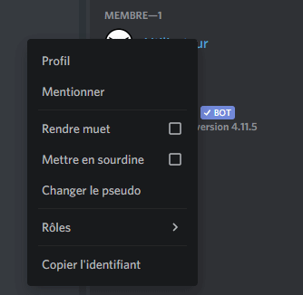

# Récupérer un identifiant

## Message 


Il vous faut au préalable activer le mode développeur pour récupérer l'identifiant d'un message.\
\
Pour ce faire, il vous suffit d'aller dans les paramètres utilisateurs, Apparence (iOS), Comportement (Android) ou Avancés (ordinateur) puis d'activer le mode développeur.


Pour récupérer l'identifiant d'un message, il vous suffit :&#x20;

* De laisser appuyer ou de faire clique droit sur un message
* Puis d'appuyer sur **Copier l'identifiant.**

## Rôle


ll vous faut au préalable activer le mode développeur pour récupérer l'identifiant d'un rôle.

Pour ce faire, il vous suffit d'aller dans les paramètres utilisateurs, Apparence (iOS), Comportement (Android) ou Avancés (ordinateur) puis d'activer le mode développeur.


Afin de récupérer l'identifiant d'un rôle, vous devez :

* Appuyer ou cliquer sur un membre qui possède le rôle dont vous souhaitez récupérer l'identifiant
* Puis appuyer longtemps sur le rôle (smartphone) ou bien cliquer droit sur le rôle et sur **Copier l'identifiant** (ordinateur).

Si vous avez besoin de mentionner un rôle (ex: panel web), il vous suffit de faire <@\&ID-Role>

## Membre


ll vous faut au préalable activer le mode développeur pour récupérer l'identifiant d'un membre.

Pour ce faire, il vous suffit d'aller dans les paramètres utilisateurs, Apparence (iOS), Comportement (Android) ou Avancés (ordinateur) puis d'activer le mode développeur.


Pour récupérer l'identifiant d'un membre, vous devez :

* Faire clique droit/cliquer sur la personne dont vous souhaitez récupérer l'identifiant
  * Si vous êtes sur smartphone, cliquez sur les trois petits points en haut à droite
* Puis appuyez sur **Copier l'identifiant**.

Si vous avez besoin de mentionner un membre (ex: panel web), il vous de mettre <@ID-Membre>

## Emoji

Pour obtenir l'identifiant d'un emoji, il vous suffit :&#x20;

* D'écrire votre emoji dans un salon textuel
* Avant l'emoji, mettez un antislash (\\)
* Puis envoyez votre message.


Si vous êtes sur **Android**, pour récupérer l'identifiant d'un emoji :&#x20;

* Envoyez`` `:LeNomDeVotreEmoji:` `` dans un salon textuel
* Puis copiez le résultat étant l'identifiant de l'emoji


## Salon


ll vous faut au préalable activer le mode développeur pour récupérer l'identifiant d'un salon.

Pour ce faire, il vous suffit d'aller dans les paramètres utilisateurs, Apparence (iOS), Comportement (Android) ou Avancés (ordinateur) puis d'activer le mode développeur.


Pour obtenir l'identifiant d'un salon, vous pouvez :&#x20;

* Appuyer ou faire clique droit sur le nom d'un salon
* Puis d'appuyer sur **Copier l'identifiant**.

Si vous avez besoin de mentionner un salon (ex: panel web), vous devez mettre <#ID-Salon>

## Serveur


ll vous faut au préalable activer le mode développeur pour récupérer l'identifiant d'un serveur.

Pour ce faire, il vous suffit d'aller dans les paramètres utilisateurs, Apparence (iOS), Comportement (Android) ou Avancés (ordinateur) puis d'activer le mode développeur.


Si vous souhaitez récupérer l'identifiant d'un serveur, il vous suffit :

* De faire un clique droit ou appuyer sur l'image/nom du serveur
* Puis d'appuyer sur **Copier l'identifiant**.

.gif>)

