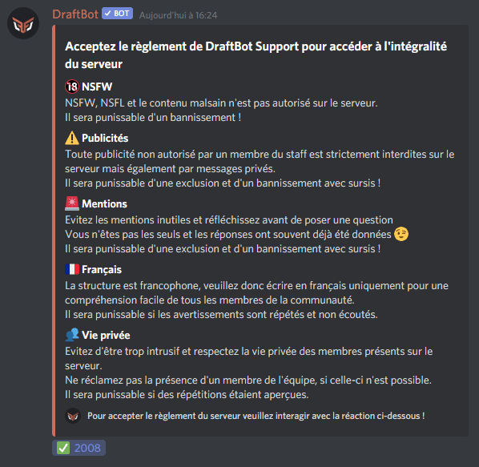
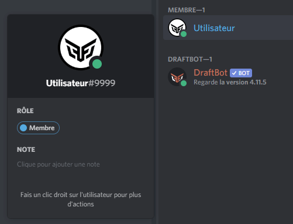

# Récupérer un identifiant

## <mark style="color:purple;">Identifiant d'un message</mark> 


Il vous faut au préalable activer le <mark style="color:purple;">mode développeur</mark> pour récupérer des identifiants.\
\
Pour se faire, il vous suffit d'aller dans les paramètres utilisateurs, Apparence (iOS), Comportement (Android) ou Avancés (ordinateur) puis d'activer le mode développeur.


Pour récupérer l'identifiant d'un message, vous devez :&#x20;

* Laisser appuyer ou cliquer droit sur un message
* Puis appuyer sur **Copier l'identifiant.**

## <mark style="color:purple;">Identifiant d'un rôle</mark>


Il vous faut au préalable activer le <mark style="color:purple;">mode développeur</mark> pour récupérer des identifiants.


Afin de récupérer l'identifiant d'un rôle, vous devez :

* Appuyer ou cliquer sur un membre qui possède le rôle dont vous souhaitez récupérer l'identifiant
* Puis appuyer longtemps sur le rôle (smartphone) ou bien cliquer droit sur le rôle et sur **Copier l'identifiant** (ordinateur).

Si vous avez besoin de mentionner un rôle (ex: panel web), il vous suffit de faire <@\&ID-Role>

## <mark style="color:purple;">Identifiant d'un membre</mark>


ll vous faut au préalable activer le <mark style="color:purple;">mode développeur</mark> pour récupérer des identifiants.


Pour récupérer l'identifiant d'un membre, vous devez :

* Faire clique droit/cliquer sur la personne dont vous souhaitez récupérer l'identifiant
  * Si vous êtes sur smartphone, cliquez sur les trois petits points en haut à droite
* Puis appuyez sur **Copier l'identifiant**.

Si vous avez besoin de mentionner un membre (ex: panel web), il vous de mettre <@ID-Membre>

## <mark style="color:purple;">Identifiant d'un émoji</mark>

Pour obtenir l'identifiant d'un émoji, il vous suffit :&#x20;

* D'écrire votre émoji dans un salon textuel
* Avant l’émoji, mettez un antislash \\
* Puis envoyez votre message.


Si vous êtes sur **Android**, pour récupérer l'identifiant d'un émoji :&#x20;

* Envoyez`` `:LeNomDeVotreEmoji:` `` dans un salon textuel
* Puis copiez le résultat étant l'identifiant de l’émoji


## <mark style="color:purple;">Identifiant d'un salon</mark>


ll vous faut au préalable activer le <mark style="color:purple;">mode développeur</mark> pour récupérer des identifiants.


Pour obtenir l'identifiant d'un salon, vous pouvez :&#x20;

* Appuyer ou faire clique droit sur le nom d'un salon
* Puis d'appuyer sur **Copier l'identifiant**.

Si vous avez besoin de mentionner un salon (ex: panel web), vous devez mettre <#ID-Salon>

## <mark style="color:purple;">Identifiant d'un serveur</mark>


ll vous faut au préalable activer le <mark style="color:purple;">mode développeur</mark> pour récupérer des identifiants.


Si vous souhaitez récupérer l'identifiant d'un serveur, il vous suffit :

* De faire un clique droit ou appuyer sur l'image/nom du serveur
* Puis d'appuyer sur **Copier l'identifiant**.

.gif>)
