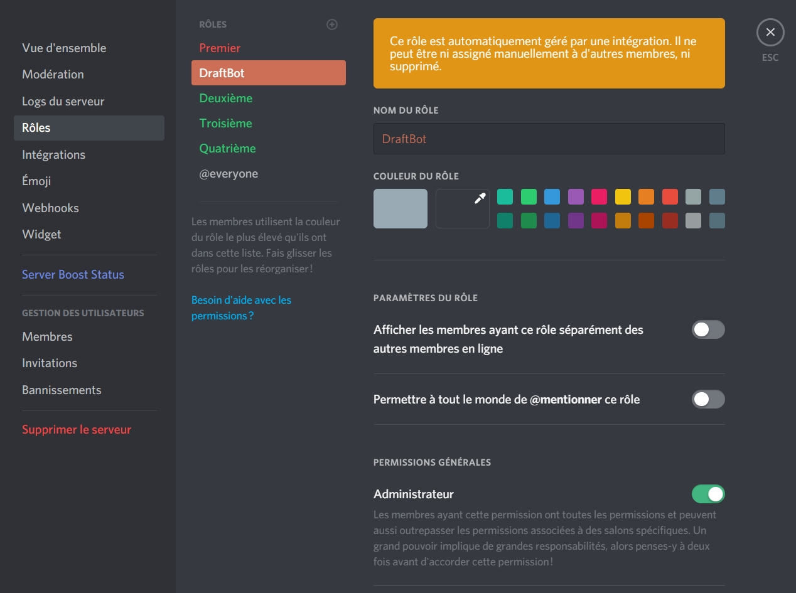

# Installation

## Invitation de **DraftBot**

#### Commençons par inviter **DraftBot** sur le serveur.

Vous pouvez l'inviter depuis le site suivant : [www.draftbot.fr](https://www.draftbot.fr)


Félicitations, 𝗗𝗿𝗮𝗳𝘁𝗕𝗼𝘁 est maintenant ajouté à votre serveur !


## Installation de DraftBot

#### Une fois DraftBot ajouté à votre serveur, il faut lui donner les permissions dont il a besoin.

Commencez par vous rendre dans les paramètres de votre serveur, dans la catégorie « Rôles » :

Activez les paramètres du rôle dont 𝗗𝗿𝗮𝗳𝘁𝗕𝗼𝘁 a besoin pour exécuter les commandes que vous voudrez utiliser. Le plus simple étant de lui donner la permission « Administrateur » :

| Permission                              |     Inutile     |   Facultative   |   Essentielle   |  Recommandée  |
| --------------------------------------- | :-------------: | :-------------: | :-------------: | :-----------: |
| Afficher séparément                     | :white\_circle: |                 |                 |               |
| Mentionner ce rôle                      |                 | :black\_circle: |                 |               |
| Administrateur                          |                 | :black\_circle: |                 | :red\_circle: |
| Voir les logs                           | :white\_circle: |                 |                 |               |
| Gérer le serveur                        |                 |                 |                 |               |
| Gérer les rôles                         |                 |                 | :black\_circle: | :red\_circle: |
| Gérer les salons                        |                 |                 | :black\_circle: | :red\_circle: |
| Expulser des membres                    |                 |                 | :black\_circle: | :red\_circle: |
| Bannir des membres                      |                 |                 | :black\_circle: | :red\_circle: |
| Créer une invitation                    |                 | :black\_circle: |                 |               |
| Changer de pseudo                       | :white\_circle: |                 |                 |               |
| Gérer les pseudos                       |                 | :black\_circle: |                 |               |
| Gérer les émojis                        | :white\_circle: |                 |                 |               |
| Gérer les Webhooks                      |                 |                 | :black\_circle: | :red\_circle: |
| Lire & voir les salons                  |                 |                 | :black\_circle: | :red\_circle: |
| Envoyer des messages                    |                 |                 | :black\_circle: | :red\_circle: |
| Envoyer des messages de synthèse vocale | :white\_circle: |                 |                 |               |
| Gérer les messages                      |                 |                 | :black\_circle: | :red\_circle: |
| Intégrer des liens                      |                 |                 | :black\_circle: | :red\_circle: |
| Joindre des fichiers                    |                 |                 | :black\_circle: | :red\_circle: |
| Voir les anciens messages               |                 |                 | :black\_circle: | :red\_circle: |
| Mentionner @everyone                    |                 | :black\_circle: |                 |               |
| Utiliser des émojis externes            |                 |                 | :black\_circle: | :red\_circle: |
| Se connecter en vocal                   |                 |                 | :black\_circle: | :red\_circle: |
| Parler en vocal                         |                 |                 | :black\_circle: | :red\_circle: |
| Couper le micro de membres              |                 | :black\_circle: |                 |               |
| Mettre en sourdine                      |                 | :black\_circle: |                 |               |
| Déplacer des membres                    |                 | :black\_circle: |                 |               |
| Utiliser la détection de voix           |                 | :black\_circle: |                 | :red\_circle: |
| Voix prioritaire                        |                 | :black\_circle: |                 |               |


Si 𝗗𝗿𝗮𝗳𝘁𝗕𝗼𝘁 n'est pas Administrateur, il faudra également penser à lui attribuer les permissions dans les salons où il devra agir.


Si vous souhaitez que 𝗗𝗿𝗮𝗳𝘁𝗕𝗼𝘁 puisse attribuer des rôles, assurez-vous que ceux-ci soient inférieurs dans la hiérarchie des rôles du serveur :

.jpg>)

> Dans notre cas par exemple, 𝗗𝗿𝗮𝗳𝘁𝗕𝗼𝘁 sera capable d'attribuer les Deuxième, Troisième et Quatrième rôles, mais ne pourra pas donner le Premier rôle.


Grâce à cette installation et si vous avez choisi de faire confiance à 𝗗𝗿𝗮𝗳𝘁𝗕𝗼𝘁 en le laissant Administrateur, vous ne devriez pas rencontrer de problème. L'installation primaire est à présent terminée, vous pouvez passer à la « Configuration ».


