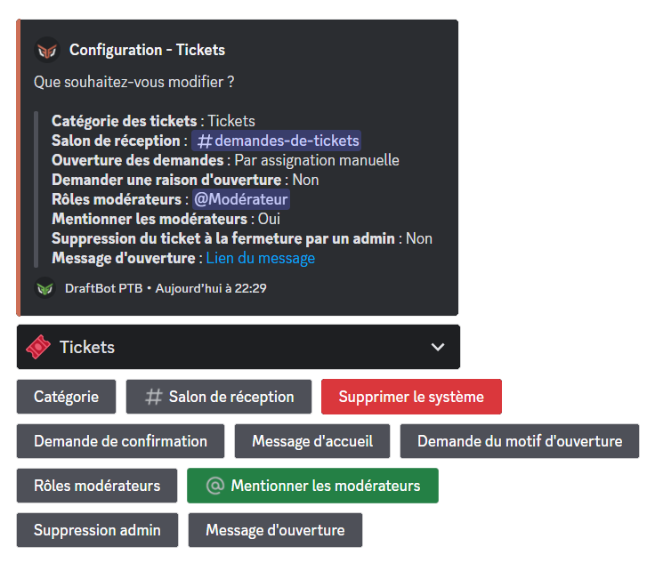

# 🎟 Tickets

### Créer un ticket
Vous pouvez créer ou demander la création d'un ticket en utilisant <mark style="color:orange;">/ticket</mark>.


Il est conseillé de donner une raison d'ouverture en complétant la variable <mark style="color:orange;">[raison]</mark> lorsque l'ouverture des tickets se fait par le biais des modérateurs.


### Modération des tickets
Les administrateurs du serveur et modérateurs de tickets disposent des commandes suivantes permettant un contrôle supplémentaire sur les accès aux tickets.

* <mark style="color:orange;">/ticketmod ouvrir </mark> ➜ Permet d'ouvrir un ticket pour un membre dans un objectif de contact privé
* <mark style="color:orange;">/ticketmod ajouter </mark> ➜ Permet d'autoriser l'accès au contenu du ticket à un membre quelconque.
* <mark style="color:orange;">/ticketmod retirer </mark> ➜ Permet de retirer l'accès au contenu du ticket à un membre.

### Salon de réception
Le salon de réception des tickets permet de recevoir les demandes de tickets des membres qu'elles soient réalisées via l'utilisation de <mark style="color:orange;">/ticket</mark> ou bien via un **message d'ouverture**.

La réception des demandes de tickets dans ce salon nécessite obligatoirement que les ouvertures de demandes soient configurées en mode **Manuel** 

 
Pour l'acceptation ou le refus des tickets, vous pouvez utiliser les boutons disponibles sous chaque demande mais également les commandes d'application Accepter et Refuser


# Configuration



Pour configurer le système de tickets, vous pouvez utiliser <mark style="color:orange;">/config</mark> puis cliquer dans la section "Tickets".


Si le système n'est pas configuré, un seul bouton "Configurer le système" sera visible. Cliquez dessus pour commencer la configuration.


>**Catégorie** ➜ Permet de définir la catégorie dans laquelle les tickets seront créés. Vous pouvez demander à DraftBot de la créer automatiquement pour vous ou bien d'en utiliser une existante.

> **Salon de réception** ➜ Permet de définir le salon qui recevra les demandes d'ouverture de ticket. Si la validation est en mode **Automatique**, seul l'historique des fermetures et suppressions de ticket sera affiché dans ce salon. Vous pouvez demander à DraftBot de créer automatiquement le salon ou bien d'en utiliser un existant.


Le salon de réception des tickets se trouve par défaut dans la catégorie que vous avez indiquée mais peut être déplacé dans une autre catégorie.


> <mark style="color:red;">**Supprimer le système**</mark> ➜ Permet de réinitialiser le système et revenir au bouton "Configurer le système".

> **Demande de confirmation** ➜ Permet de modifier le message de confirmation affiché lorsqu'un ticket est demandé. (Modifiable uniquement si la validation des tickets est en mode **Manuel**). Vous pouvez choisir la présentation "Par défaut" de DraftBot ou votre texte personnalisé en cliquant sur "Modifier".

> <mark style="color:green;">**Demande du motif d'ouverture**</mark> ➜ Permet d'obliger les membres ou non à indiquer une raison d'ouverture du ticket. La raison fournie est indiquée dans le message d'accueil du ticket ainsi que sur la demande d'ouverture si la validation des tickets est en mode **Manuel**.

> **Message d'accueil** ➜ Permet de modifier la description du message d'accueil d'un ticket **uniquement** lorsqu'il a été ouvert via <mark style="color:orange;">/ticketmod ouvrir</mark>. Lorsqu'un ticket est ouvert via <mark style="color:orange;">/ticket</mark> la description du message d'accueil contient alors la raison indiquée par le membre.

> **Rôles modérateurs** ➜ Ajouter ou retirer des rôles n'ayant pas la permission Administrateur qui auront accès aux tickets. Plusieurs rôles peuvent être ajoutés.

> **Mentionner les modérateurs** ➜ Activer / désactiver la mention automatique des rôles indiqués comme rôles modérateurs à chaque nouveau ticket ouvert. Si cette option est activée, tous les rôles modérateurs seront mentionnés, il n'est actuellement pas possible de choisir les rôles à mentionner parmi la liste des rôles modérateurs.

> **Suppression admin** ➜ Lorsque cette option est activée, les tickets sont directement supprimés si un membre Administrateur ferme un ticket.





Sur le panel, dans la catégorie **Communautaire** vous retrouverez sur la partie des **Tickets**, les mêmes possibilités de configuration qu'avec les commandes Slash sur Discord excepté le message d'ouverture.

> ⚠️ Une fois vos modifications effectuées, n'oubliez pas d'enregistrer avec le bouton "Enregistrer" situé en bas de la page.

* **Catégorie des tickets** ➜ Permet de définir la catégorie dans laquelle les tickets seront créés. La catégorie doit avoir été préalablement créée. Pensez à actualiser la page du panel si vous avre créé une catégorie entre-temps.

* **Mention des modérateurs** ➜ Permet d'activer la mention automatique des modérateurs lors de l'ouverture d'un ticket

* **Rôles modérateurs de tickets** ➜ Ajouter ou retirer des rôles n'ayant pas la permission Administrateur qui auront accès aux tickets. Plusieurs rôles peuvent être ajoutés.

* **Suppression automatique (admin)** ➜ Lorsque cette option est activée, les tickets sont directement supprimés si un membre Administrateur ferme un ticket.

* **Validation des tickets** ➜ Lorsque la validation est activée (Assignation manuelle depuis /config), les demandes de tickets sont transférées dans le **salon de réception** et doivent être acceptées / refusées par les **modérateurs de tickets** ou administrateurs.
Si elle est désactivée, les tickets demandés par les membres s'ouvrent instantanément.

* **Motif d'ouverture** ➜ Permet d'obliger ou non les membres à spécifier un motif d'ouverture du ticket lors de l'utilisation de <mark style="color:orange;">/ticket</mark>. Son activation est conseillée afin d'éviter les spams de tickets / demandes sans raison particulière.




## Message d'ouverture
